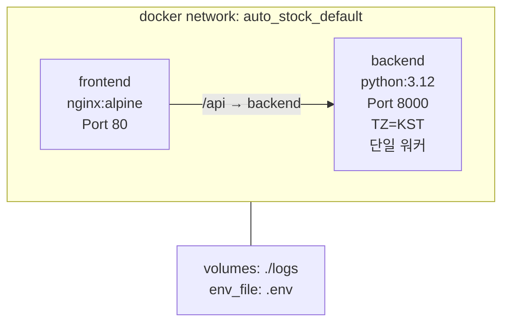
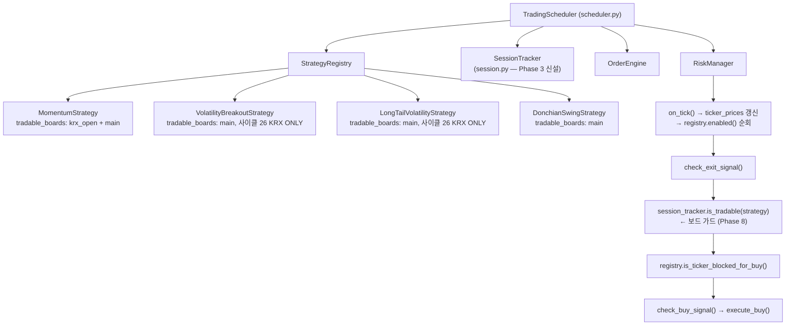
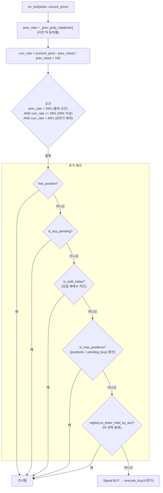
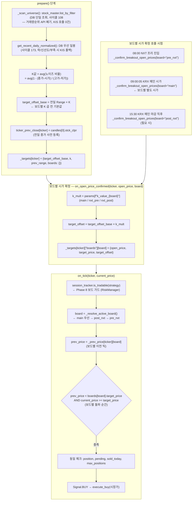
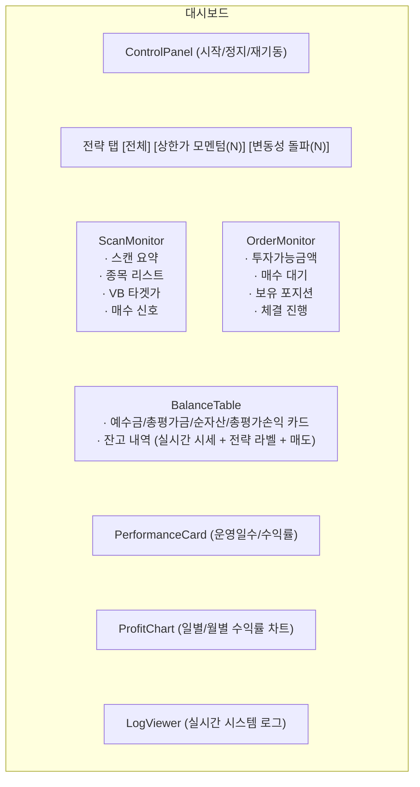

> 원본: `docs/architecture.md` · 이관: 2026-09-17

정본은 [`docs/architecture.md`](../architecture.md). 이 파일은 거기서 걷어낸 원문을
**고치지 않고** 옮겨 둔 것이다(append-only). 사이클 축으로 찾으려면
[`docs/HARNESS_CHANGELOG.md`](../HARNESS_CHANGELOG.md) 로 간다.

절 제목은 **이관 시점의 정본 절 제목**이다. 이관하면서 제목 자체를 바꾼 절은 괄호로 구 제목을 적었다.

---

## 1. 전체 아키텍처

### 2026-09-17 이관 — TLS 부재(알려진 한계 L1) 시절의 인증 흐름 첫 줄

```
   | (1) http://<EC2>:80/…            ← 평문 HTTP (TLS 없음 = 알려진 한계 L1, 후속 F1)
```

→ CHANGELOG: cycle255(1단계) · cycle260/cycle267(2단계)

## 2. 백엔드 모듈 구조

### 2026-09-17 이관 — 시세 채널 리졸버 — cycle257→293→294 단계 서술

```
│   └── scanner.py           # 종목 스캔 + 공용 시세 캐시 + **시세 채널 리졸버**(cycle293 속성축 → **cycle294 시각축 합성**. `tick_tr_id_for(ticker, *, priority, now)` 가 프리장은 H0NXCNT0 · 정규장+애프터는 H0STCNT0 로 보내고 **정상 경로에서 통합을 반환하지 않는다**. 정본 집합 TICK_TR_IDS. 사이클 26 시각 분기는 cycle257 삭제)
```

→ CHANGELOG: cycle293 · cycle294

## 5. 일일 매매 스케줄 시퀀스

### 2026-09-17 이관 — 08:00 PRE_NXT — VB 도 프리장에서 매수한다는 서술

```
       │  VB + LTV PRE_NXT 매매 시작 (k_value_nxt_pre 적용)
```

→ CHANGELOG: 사이클 26 · 사이클 38

### 2026-09-17 이관 — 15:30 = 'NXT 애프터 전환' · VB/LTV 둘 다 POST_NXT 비활성 서술

```
15:30  KRX 메인 마감 → NXT 애프터 전환       (TIME_KRX_MAIN_CLOSE)
       │  _phase = "post_nxt_trading"
       │  _confirm_breakout_open_prices(board="post_nxt")  ← LTV 상한가 모드 보유 +
       │                                                      donchian 보유 시세 확정용
       │  구독 유지: VB/LTV 보유 종목 + donchian 보유 (positions HIGH 그룹)
       │  매수는 VB/LTV 둘 다 POST_NXT 비활성 — 손절 평가만 risk.on_tick 청산 분기로 작동
```

→ CHANGELOG: 사이클 26 · cycle287 · cycle294

### 2026-09-17 이관 — AI 자문이 19:50 블록에 적혀 있던 자리

```
19:50  NXT 애프터 신규 매수 중단              (TIME_NXT_POST_BUY_STOP)
       │  buy_disabled = True (모든 활성 전략)
       │  generate_recommendations()  (전략수정 AI자문)
       │  ├─ collect_metrics() ──────────────────→ DB trade_history 집계
       │  ├─ OpenAI Chat Completion ─────────────→ 외부 API
       │  └─ insert_recommendation() → DB parameter_recommendations (status: pending)
       │
20:00  NXT 애프터 종료, unsubscribe_all() ──→ WebSocket 구독 해제
       │                                       (TIME_NXT_POST_CLOSE)
```

→ CHANGELOG: Phase 0 (2026-05-15) · 사이클 101

## 9. DB 스키마

### 2026-09-17 이관 — Supabase → RDS 이전(M0~M6) 서술

```
> **DB 클라이언트 (Supabase→RDS 이전 M0~M6)**: 현재 정본 = AWS RDS PostgreSQL + `src/db/pg.py`(asyncpg 풀). 전 db 모듈이 `pg.fetch`/`pg.execute` 네이티브 async 경유. `src/db/supabase.py` 는 롤백용 병존(미사용). asyncpg 계약 = JSONB codec(raw dict) / TIMESTAMPTZ `to_char(+09:00)` 읽기 / DATE `_kst.to_date()` / NUMERIC→Decimal. 스키마(테이블 구조·마이그레이션)는 이전 전후 동일.
```

### 2026-09-17 이관 — stock_master_daily 적재 16:00 표기

```
| `stock_master_daily` | 033 | KIS FHKST03010100 일봉 정규화 — PK (ticker, bas_dd) + OHLCV + change_rate + raw JSONB. 매일 16:00 KST 적재 (T-100 백필 → D-1 증분) |
```

→ CHANGELOG: cycle283 D2

### 2026-09-17 이관 — strategy_funnel_snapshots / stock_master_history 행의 변경 경위

```
| `strategy_funnel_snapshots` | 030 (+035) | 전략별 조건검색 단계별 후보/탈락 영구 추적 — UPSERT 전환 (사이클 145, snapshot_at 키 폐기) |
| `stock_master_history` | 032 (+036) | stock_master 갱신 이력 — PK (ticker, seq=0/1) + trigger 재설계 (사이클 150, 92K→4,358 row -96.9%) |
```

→ CHANGELOG: 사이클 145 · 사이클 150

## 12. 배포 환경 (AWS EC2)

### 2026-09-17 이관 — 무조건 `up --build` 였던 배포 도식

```
git push ───────────→ Actions trigger
                      ├─ appleboy/ssh-action
                      └──────────────────────────────→ SSH 접속
                                                       ├─ git pull origin main
                                                       ├─ docker compose build
                                                       └─ docker compose up -d
```

→ CHANGELOG: cycle114 · cycle248

### 2026-09-17 이관 — 구 CI/CD 파이프라인 블록

````
.github/workflows/deploy.yml
─────────────────────────────
트리거: push to main (*.md, docs/**, _workspace/** 제외)

jobs:
  deploy:
    ├─ SSH 접속 (appleboy/ssh-action)
    ├─ cd ~/auto_stock
    ├─ git pull origin main
    ├─ docker compose -f docker-compose.prod.yml up --build -d --remove-orphans
    └─ docker image prune -f
```

GitHub Secrets: `EC2_HOST`, `EC2_USERNAME`, `EC2_SSH_KEY`
````

→ CHANGELOG: cycle114 · 사이클 145 · cycle248

## 13. 확장 인프라 (구 제목: 13. 사이클 5~14 추가 인프라)

### 2026-09-17 이관 — 13장 제목·머리말이 사이클 범위였던 것

```
## 13. 사이클 5~14 추가 인프라 (2026-05-17 ~ 5/18)

본 절은 본문(1~12 섹션) 작성 이후 도입된 인프라를 요약. 상세는 `docs/HARNESS_CHANGELOG.md` 와 각 디렉토리 CLAUDE.md.
```

### 2026-09-17 이관 — 13.1 — kojiro 다크런치 · Phase 1/2 자금관리 표기

```
- 신규: `kojiro` (고지로 대순환 스윙, 2026-07 Phase 1 다크런치 `enabled=False`. EMA 5/20/40 대순환 스테이지 + ATR/종가 밴드 1.0~4.5% → strict entry(스테이지1 + 6→1 인접 + 3선 우상향 + 종가>EMA5) → 09:05~09:30 시장가(갭업/갭다운/붕괴 스킵). 청산 = 고정%(-8%)→2ATR→스테이지3→2.5ATR 트레일. **멀티데이**. Phase1 = position_ratio, 터틀 유닛 sizing/피라미딩 = Phase 2. 지표 순수모듈 `kojiro_indicators.py`)
```

→ CHANGELOG: 사이클 R1 (2026-07)

### 2026-09-17 이관 — 13.1 — _MULTIDAY_STRATEGIES 리터럴 통합 경위

```
- **코드 정본 `_MULTIDAY_STRATEGIES = frozenset({donchian_swing, vcp_breakout, kojiro})`** — `is_next_day` 항상 False. 3 전략 모두 `strategy_base.py` 리터럴에 정적 선언 (2026-07 — vcp 동적 side-effect 추가 패턴을 리터럴로 통합)
```

→ CHANGELOG: 사이클 R1 (2026-07)

### 2026-09-17 이관 — 13.3 — 매수 가드 4모드가 실제로 매수를 막던 시절의 서술

```
### 13.3 시장 레짐 + 매수 가드 (4 모드)

- `src/engine/market_regime.py` — dkstock.cloud 매크로 fetch → `MarketRegime` dataclass (regime/vix/fear_greed/buffett/cash_min)
- 4 모드 매수 가드 (DB `buy_block_mode`): `OFF` / `WARN` (로그만) / `SOFT` (`execute_buy(soft_multiplier=0.5)` — 수량 절반 축소) / `HARD` (매수 skip)
- 4 임계 OR: `regime=defensive` (toggle) / `vix > vix_threshold` / `fear_greed_score > fg_high_threshold` / `< fg_low_threshold`
```

→ CHANGELOG: 사이클 8 · 사이클 I (2026-08-03) · 2026-08-07 자문 계층 정직화

### 2026-09-17 이관 — 13.6 — stale 임계 변천과 보조 세션 점진 활성화 기록

```
### 13.6 운영 안정성 (사이클 9 / 11 / 13 / 14)

- WebSocket stale watcher 임계 보수화 → 회복 강화:
  - `STALE_WATCHER_INTERVAL_SECS=120` / `STALE_FRESHNESS_SECS=60` / `MAX_STALE_RETRIES=5` (6회 이상 stale → 시간 기반 force_retry 경로 위임. 구 `STALE_FORCE_REREGISTER_AFTER` 는 2026-08-19 dead 상수로 제거)
  - 다중 안전망: F1 (재연결 1회) + `_scan_loop` (5분) + K watcher (120s) + `_resubscribe_stale_priority` (5분 우선) = 4중
- `_subscriptions` 정합성 가드 (in-flight ACK race 차단)
- `_report_tick_coverage()` 풀 통합 — 사이클 11 짝궁 누락 fix
- `list_accounts()` 60s TTL 메모리 캐시 — 폴링 race + supabase HTTP/2 stale connection 결함 차단
- 운영 점진 활성화: 보조 0개 → 1 → 5 (코드 배포 / 첫 등록 / 점진 추가). KRX 메인 시간 중 빈번한 push 자제 (재시작 race), NXT 애프터 또는 익일 boot 전 push 권장
```

→ CHANGELOG: 사이클 9 / 11 / 13 / 14 · cycle232 D6 · cycle283 D8

## 14. 운영 계약 (구 제목: 14. 사이클 26~165 추가 인프라)

### 2026-09-17 이관 — 14장 제목·머리말이 사이클 범위였던 것

```
## 14. 사이클 26~165 추가 인프라 (2026-05-20 ~ 6-19)

상세는 `docs/HARNESS_CHANGELOG.md` 와 각 디렉토리 CLAUDE.md. 본 절은 본문(1~13) 이후 도입된 핵심 사실 요약.
```

### 2026-09-17 이관 — 14.1 — VB/LTV 가 둘 다 main 단독이라는 서술

```
- 매매 정책 = KRX 메인 09:00~15:20 단독. VB/LTV `tradable_boards=("main",)` (PRE_NXT/POST_NXT 매수 비활성)
```

→ CHANGELOG: 사이클 26 · 사이클 38

### 2026-09-17 이관 — 14.1 — 시세 채널 cycle257→293→294 경위 문단

```
- 시세 채널 시간대별 6 구간 분기 + 사전 구독 마진(50초) 종목별 원자 전환은 **108일간 미배선으로 cycle257 에서 삭제**. **cycle293(2026-09-14)이 그 자리에 속성축 리졸버를 놓았고(2단계), cycle294 가 시각축을 합성해 통합 채널을 반환 경로에서 지웠다(3단계)** — `scanner.tick_tr_id_for(ticker, *, priority, now)` 가 프리장은 `H0NXCNT0`, 정규장+애프터는 `H0STCNT0` 를 돌려주고, 전환은 `tick_channel_clock.switch_windows()` 가 표에서 파생한 **창 안에서만** 일어난다(아침 1 + NXT 단독 연속 구간 경계 2). 판정 실패의 폴백도 전용 채널이다(L1=KRX / L2=프리 창 NXT / L3=`off` 만 통합). 킬스위치 `system_config.tick_channel_resolver_mode`(기본 `observe` = 행위 0) + 다이얼 5키. 종착지였던 통합 채널 폐기(2026-09-07 사용자 결정)는 **이 단계가 그 종착지다** — 상세 = `src/realtime/CLAUDE.md` 「시세 채널」 절
```

→ CHANGELOG: cycle252 · cycle257 · cycle293 · cycle294

### 2026-09-17 이관 — 14.2 — market_op_subscribe 사이클 사슬(214→221→230→292)

```
- `src/engine/market_op_subscribe.py` — **구독 배치**(cycle292 가 `scheduler._subscribe_market_operation_tickers` 본체를 leaf 로 추출, 행위 변경 0 · scheduler 에는 5줄 위임 wrapper). 현행 계약 = 대상은 **보유+익일청산뿐**(후보 VI 는 cycle221 F2 로 삭제 — 실질 noop 이던 경로) · 메인 세션 **0건**(cycle230 이 cycle214 의 `bypass_limit=True` 메인 직접 구독을 폐기 — 08-19 OPSP0008 사고) · 보조 세션 **직접** 라운드로빈 + `bypass_limit=False` · 실효 상한은 `MAX_SUBSCRIPTIONS`(41)이고 `cap`(기본 60) 은 cycle214 시그니처 잔재(vestigial)
```

→ CHANGELOG: cycle214 · cycle221 F2 · cycle230 · cycle292

### 2026-09-17 이관 — 14.3 — 용량 정합 사이클의 수치 기록

```
### 14.3 사이클 150 — SUPABASE 용량 정합

- migration 036 = stock_master_history PK (ticker, seq=0/1) + trigger 재설계 → 92K→4,358 row -96.9%
- `purge_old_rows()` T-150일 retention cron 매일 16:15 KST + protected_tickers 보호
- `_purge_by_cutoff` 2-step subquery — supabase-py DELETE chain `.limit()` 미지원 silent 24일 영구 차단
```

→ CHANGELOG: 사이클 150

### 2026-09-17 이관 — 14.4 — 절 제목 + 사고 서술

```
### 14.4 사이클 160 — `_wait_until` 본질 복원 (HIGH 매매 안전성)

- 2 모드 분기: default 즉시 break (run_daily phase 전환) + `advance_if_passed=True` (task_loop_helper 폭주 차단)
- 사이클 152 hotfix 가 깨뜨린 본질 복원 = 6/17 15:20 강제청산 누락 사고 (알테오젠/알지노믹스) 영속 차단
```

→ CHANGELOG: 사이클 152 · 사이클 160

### 2026-09-17 이관 — 14.5 — 사이클 147 패턴 답습 표기

```
- BUY trade_history.price = KIS CNTG_UNPR (체결단가) 강제 — 사이클 147 SELL fallback chain 패턴 답습
- UniqueViolation → 강제 UPDATE chain 영속
```

→ CHANGELOG: 사이클 147 · 사이클 161

### 2026-09-17 이관 — 14.7 — 절 제목 + 사이클 158 hook 부족 서술

```
### 14.7 사이클 163 — 2차 _boot stock_master race 가드 + 5 전략 prepare 재시도 hook

- `count_active()` polling 5분 cap (10초 주기) — 사이클 158 hook 90초 부족 영속 시정
```

→ CHANGELOG: 사이클 158 · 사이클 163

### 2026-09-17 이관 — 14.9 — 순수 작업 기록 + 14장 위임 메모

```
### 14.9 사이클 165 — docstring 보강 + CLAUDE.md 반복 단어 정리

- 6 파일 docstring 보강 (+96L) — TR_ID 분기 / msg_cd 누적 / KIS MCP 정본 fields 매핑 / 가드 계층 / 가드 매트릭스 인용
- 4 CLAUDE.md 반복 단어 30건 → 0건 정리 (의미 보존)
- 행위 변경 0 / 백엔드 풀 3,040 PASS

---

> 본 14장은 13장 이후 도입된 인프라의 요약. 14.1 (KRX ONLY 보드 전환) 영역 도식 갱신 + 14.6 (동시호가 시각 분기) 시퀀스 다이어그램은 별도 사이클로 위임.
```

→ CHANGELOG: 사이클 165

## 15. 프로세스 분리 로드맵

### 2026-09-17 이관 — "리포 안의 실재 최신 사이클은 cycle278" 시점 주석

```
> 1단계가 "진행 중"인 근거는 **사용자 결정(2026-09-11 — "1단계만 진행")** 이다. 사이클 번호
> `cycle279` 는 예약해 둔 것이고 명세·코드·changelog 항목은 아직 없다(리포 안의 실재 최신
> 사이클은 cycle278). 2·3단계는 승인된 설계가 아니라 방향 기록이다.
```

### 2026-09-17 이관 — 15.5.1 — "보류 표기는 지우지 않는다" 자기 편집 서술

```
**그래서 15.4 의 "보류" 표기는 지우지 않는다.** ①~④ 는 여전히 참이고, 4단계는 그중 셋에
답하는 설계안이다. 아래가 그 대조다.
```

### 2026-09-17 이관 — 15.5.1 — 앵커 밀림 정정 문단(문서 자기 편집 기록)

```
⚠️ 15.4 표의 파일:줄 앵커 중 둘은 그 뒤 사이클에서 **밀렸다**(실측 2026-09-15) —
`websocket_pool.py` 의 `_EXECUTION_NOTICE_TR_IDS` 는 `:59`→**`:64`**, `_enforce_main_only_execution_notice`
는 `:62`→**`:109`**(예외 `:57`), `order_engine.py` 의 A-ATOMIC 구간은 `:314`~`:355`→
**`:741`(`calc_buy_quantity`) ~ `:782`(`pending_buys.add`) ~ `:784`(`pending_buy_amounts`)** 다.
15.4 본문의 앵커는 이 사이클에서 현행 값으로 고쳤다. 제약 자체는 넷 다 그대로 살아 있다.
```

### 2026-09-17 이관 — 15.5.9 열린 질문 ① — 문서 구조를 어떻게 쓸까(문서 자기 편집 질문)

```
1. **문서 구조** — 15.4(3단계)를 "4단계 설계로 대체 검토 중" 으로 다시 쓸 것인가, 지금처럼
   병존시킬 것인가. 지금 문서만 읽으면 "3단계를 먼저 해야 4단계" 로 읽힐 여지가 있다.
```

### 2026-09-17 cycle298 이관 — 5장 시퀀스의 `TIME_BOOT` · `TIME_POST_NXT_OPEN` 시각 주석

두 상수는 런타임 참조가 0건이다(2026-09-17 grep 전수). 아래가 그 전까지 정본에 있던 원문이다.

```
07:55  _boot()                 (TIME_BOOT)

15:40  POST_NXT 보드 진입                     (TIME_POST_NXT_OPEN)
       │  SessionTracker 보드 = post_nxt  (15:30~15:40 은 MAIN 유지 = 종가 흡수 마진)

       │      07:55 prepare 보다 늦다 → `[daily_head_stale]` WARNING)

| R | `TIME_BOOT` 토큰 선발급 · `TIME_STOCK_MASTER_*`(16:10/16:30/16:40) · 일봉 적재(20:30) · 유니버스 적재(20:00:05) |
```

`15:40 POST_NXT 보드 진입` 줄 자체는 `session._BOARD_SCHEDULE` 기준으로 사실이라 남기고,
근거 주석만 상수에서 `_BOARD_SCHEDULE` 로 바꿨다. 스케줄러의 전환·시가 확정은 같은 시퀀스의
15:30 블록에 이미 바르게 적혀 있다.

→ CHANGELOG: cycle298 행

## 9.1 확장 테이블

### 2026-09-26 cycle364 S1 — `strategy_funnel_snapshots` 행

정본 원문(표 행):

| `strategy_funnel_snapshots` | 030 (+035) | 전략별 조건검색 단계별 후보/탈락 영구 추적 — UNIQUE `(target_date, strategy_id, step_no)` + UPSERT |

경위: 잠정(`is_provisional`, migration 040) 쓰기가 확정 행을 덮지 못한다는 사실(③-b)을 행에 더했다.

→ CHANGELOG: cycle364 S1 행

## 15.3 2단계 — 관측·분석 분리 (계획 · 착수 미정)

### 2026-09-26 cycle364 S1 — 「퍼널 스냅샷」 행의 `scheduler.py` 줄 번호와 호출자

정본 원문(표 행):

| 퍼널 스냅샷 | 가를 수 없다 | 데이터 원천이 DB 가 아니라 **엔진 프로세스의 메모리**다. `capture_funnel_snapshots(registry, …)`(`scheduler.py:186`)가 registry 를 순회해 각 전략의 `_funnel_steps` 를 읽고(`:236`, 접근 실패 로그 `:238`), 호출자는 `_scan_loop` 안의 `:2424` 다. 워커 프로세스엔 그 객체가 없다 |

경위: `scheduler.py` 줄 번호를 현재 값으로 맞췄다(186/236/238/2424 는 이 사이클 이전부터 어긋나 있었다). 호출자에 21:00 저녁 미리보기(`funnel_capture.evening_capture_once`)를 더했다.

→ CHANGELOG: cycle364 S1 행

## 15.5.7 scheduler.py 는 여섯 번째 프로세스가 아니다

### 2026-09-26 cycle364 S1 — 소유 표의 퍼널 캡처 시각

정본 원문(표 행):

| 1 | `_scan_loop`(9:30~) · `_confirm_breakout_open_prices`(9:00:05) · `_swing_buy_poll_loop` · `_swing_rest_poll_loop` · 퍼널 캡처(16:20) |

경위: 퍼널 캡처가 09:35 확정 + 21:00 저녁 미리보기가 됐다. 저녁 흐름 도식(5장)과 시각 표에는 21:00 행을 더했다(추가라 옮길 원문 없음).

→ CHANGELOG: cycle364 S1 행

## 1. 전체 아키텍처

### 2026-09-26 sync-docs — 요청 인증 흐름의 헤더 주입 노드

정본 원문:

````
    HDR["(2) location /api/ 헤더 주입<br/>proxy_set_header X-API-Key #quot;${API_AUTH_KEY}#quot;<br/>proxy_set_header Host $http_host"]
````

경위: nginx 는 cycle249 부터 `map $remote_user $api_key_for_user` 가 고른 키를 주입한다(`frontend/nginx.conf.template`). 노드가 그 전의 `${API_AUTH_KEY}` 직접 주입을 적고 있었다.

→ CHANGELOG: 해당 없음 — 2026-09-26 `/sync-docs` 문서 정합(코드 변경 없음, report-writer)

## 1. 전체 아키텍처

### 2026-09-26 sync-docs — 컨테이너 구성 — 2개 서술

정본 원문:

````
### 컨테이너 구성 (Docker Compose)


````

경위: `docker-compose.prod.yml` 의 서비스는 backend · frontend · macro 셋이다(macro = cycle303). 전체 아키텍처 그림에도 macro 를 더했다(추가라 옮길 원문 없음).

→ CHANGELOG: 해당 없음 — 2026-09-26 `/sync-docs` 문서 정합(코드 변경 없음, report-writer)

## 3. 모듈 의존관계

### 2026-09-26 sync-docs — engine 상자의 전략 노드

정본 원문:

````
        OE --> STR["strategies<br/>momentum<br/>volatility"]
````

경위: 전략 노드가 momentum·volatility 둘만 적고 있었다. 등록 전략은 7개다.

→ CHANGELOG: 해당 없음 — 2026-09-26 `/sync-docs` 문서 정합(코드 변경 없음, report-writer)

## 4. 매매 엔진 내부 구조

### 2026-09-26 sync-docs — 엔진 그림과 전략 멤버 표(4전략)

정본 원문:

````
## 4. 매매 엔진 내부 구조



**전략 객체의 멤버**

| 전략 | 멤버 |
|------|------|
| MomentumStrategy | `StrategyConfig (id, name, weight, params{tradable_boards, exchange, ...})` · `StrategyState (positions, pending_buys, sold_today, pnl, cached_buyable_*, buy_blocked_until, low_funds_tickers)` |
| VolatilityBreakoutStrategy | `StrategyConfig (k_value_krx_main / k_value_nxt_pre[호환] / k_value_nxt_post[호환])` · `StrategyState` · `_targets (K, prev_range, target_offset_base, boards: {board: {open_price, target_price, target_offset}})` · `_next_day_clear_pending`(안전망: 15:20 청산 누락 시 익일 NXT 프리 청산) |
| LongTailVolatilityStrategy | `+ _limit_up_reached` set (상한가 모드 전환 종목) |
| DonchianSwingStrategy | `_candidates` / `_bought_today` / `_scan_stats` |
````

경위: 그림·표가 momentum·VB·LTV·donchian 넷만 다뤘다. LTV 노드가 `main` 단독으로 적혀 있었는데 코드 `DEFAULT_TRADABLE_BOARDS` 는 `("pre_nxt", "main", "post_nxt")` 다. VB 행의 「익일 NXT 프리 청산」은 현행 익일청산(08:00 판정 → 미달이면 09:00 KRX 시장가)과 다르다. donchian·kojiro 의 틱 매수 평가 skip 경로도 그림에 없었다.

→ CHANGELOG: 해당 없음 — 2026-09-26 `/sync-docs` 문서 정합(코드 변경 없음, report-writer)

## 5. 일일 매매 스케줄 시퀀스

### 2026-09-26 sync-docs — 시각 표의 08:00 · 09:00:05 · 15:30 행

정본 원문:

````
| 08:00 | `TIME_PRE_NXT_OPEN` | `_execute_next_day_clear()` 는 비차단(`NEXT_DAY_STABILIZE_SECS=30s` 안정화)이고 다음 영업일 NXT 프리 시가에서 청산한다(Q2=B). 시가 확정은 0.5초/5초 폴링. LTV 는 `k_value_nxt_pre` 적용. VB 는 `DEFAULT_TRADABLE_BOARDS=("main",)` — 프리장 매수 없음 |
| 09:00:05 | `TIME_KRX_OPEN_CONFIRM` | 보드별 별도 시가. `k_value_krx_main` 적용 |
| 15:30 | `TIME_KRX_MAIN_CLOSE` | post_nxt 시가 확정은 LTV 상한가 모드 보유 + donchian 보유 시세 확정용. 구독 유지 = VB/LTV 보유 종목 + donchian 보유(positions HIGH 그룹). VB 는 POST_NXT 매수 비활성(main 단독). LTV 는 코드 기본에 post_nxt 가 있고 실제 활성 보드의 정본은 DB `strategy_config.params.tradable_boards` 다. 손절·트레일링·익일청산 평가는 보드와 무관하게 계속 돈다 |
````

경위: 08:00 — 익일청산은 NXT 프리 시가에서 청산하지 않는다. 갭 미달·시가 미수신·`nxt_tradable=False` 는 `_pending_next_day_clear` 로 보류돼 09:00 KRX 시장가로 판다(`scheduler._execute_next_day_clear`). 09:00:05 — VB·LTV `main` 기준가는 KRX REST 단일 출처(cycle272)라 이 호출이 09:05 전까지 두 전략을 건너뛴다(`open_price_rest.owns_board`). 15:30 — post_nxt 시가 확정 대상은 VB·LTV 뿐이라(`_confirm_breakout_open_prices`) donchian 은 대상이 아니고, 구독 유지(positions HIGH)는 전 전략 보유다. 09:05~09:30 스윙 매수 폴 행과 시퀀스 노트는 추가라 옮길 원문 없음.

→ CHANGELOG: 해당 없음 — 2026-09-26 `/sync-docs` 문서 정합(코드 변경 없음, report-writer)

## 8. 전략 매수 신호 흐름

### 2026-09-26 sync-docs — 8.1 · 8.2 원문(2전략만 다루던 시절)

정본 원문:

````
## 8. 전략 매수 신호 흐름

### 8.1 상한가 모멘텀



### 8.2 변동성 돌파 (보드별 분리 — Phase 5 Q1=C)



`_scan_universe()` 필터:

- 시총 = `raw.hts_avls` (억원) JSONB 필터 ≥ `min_market_cap`
- 거래대금 = `raw.acml_tr_pbmn` JSONB 필터 ≥ `min_trade_amount`
- 0종목 확정 시 ERROR 로그 + `system_logs` 기록
````

경위: 8장이 momentum·VB 둘만 다뤘다. 8.3~8.7(LTV·donchian·BFB·VCP·kojiro)을 더했다. 8.1 의 E5 노드는 전략 안이 아니라 `risk.on_tick` 이 보는 `is_ticker_blocked_for_buy` 로 고쳤고 15:20 컷을 넣었다. 8.2 는 VB 가 `main` 단독이고 `main` 기준가가 KRX REST 시가 하나라는 현행(cycle272)에 맞춰 다시 그렸다.

→ CHANGELOG: 해당 없음 — 2026-09-26 `/sync-docs` 문서 정합(코드 변경 없음, report-writer)

## 9. DB 스키마

### 2026-09-26 sync-docs — 9.1 `market_regime_snapshots` 행

정본 원문:

````
| `market_regime_snapshots` | 022 | dkstock.cloud 매크로 일일 스냅샷 — `_boot()` 시점 1행 + `buy_blocked/computed_cash_usage_ratio/raw_response JSONB` |
````

경위: 레짐 출처는 cycle315 부터 우리 `macro` 컨테이너다. dkstock.cloud 는 2026-08-18 철거됐다.

→ CHANGELOG: 해당 없음 — 2026-09-26 `/sync-docs` 문서 정합(코드 변경 없음, report-writer)

## 10. 프론트엔드 구조

### 2026-09-26 sync-docs — 대시보드 레이아웃 그림

정본 원문:

````
### 대시보드 레이아웃



위에서 아래로 화면 행 순서다. ScanMonitor(좌)·OrderMonitor(우)만 한 행을 반씩 나눠 쓰고, 나머지 행은 전체 폭이다.
````

경위: 전략 탭은 `/api/trading/status` 의 전략 목록으로 그려져 7전략이 다 나온다. `Dashboard.tsx` 에는 MarketRegimeCard · PortfolioRiskCard · KisAccountPoolCard 가 있고 LogViewer 는 `/logs` 메뉴로 옮겨 갔다.

→ CHANGELOG: 해당 없음 — 2026-09-26 `/sync-docs` 문서 정합(코드 변경 없음, report-writer)

## 12. 배포 환경 (AWS EC2)

### 2026-09-26 sync-docs — 배포 흐름 그림의 모드 표기

정본 원문:

````
        MIG --> CU["tools/deploy/compose_up_changed.sh<br/>(full / frontend / none — 15.7)"]
````

경위: 모드는 full · 선택 배포(`frontend`·`macro`·`frontend+macro`, cycle303) · none 이다.

→ CHANGELOG: 해당 없음 — 2026-09-26 `/sync-docs` 문서 정합(코드 변경 없음, report-writer)

## 13. 확장 인프라 — 전략 · 시세 풀 · 레짐 · 백테스트 · 자문

### 2026-09-26 sync-docs — 13.1 전략 3종 서술

정본 원문:

````
- `bull_flag_breakout` (눌림목 돌파, `stock_master.list_by_filter` 시총·거래대금 컷 → 폴 자동 검출 + 플래그 검출 → 09:05~13:00 돌파 + 거래량 ≥ 평균×2. 5영업일 시간 청산, 3영업일 쿨다운)
- `vcp_breakout` (미네르비니식 VCP. 일봉 100일(prepare cap) → 추세 필터 + 베이스 검출 + pullback 점진 수축 + 거래량 수축 → 09:05~14:30 돌파. **멀티데이 보유**. 7영업일 쿨다운)
- `kojiro` (고지로 대순환 스윙 — EMA 5/20/40 대순환 스테이지 + ATR/종가 밴드 1.0~4.5% → strict entry(스테이지1 + 6→1 인접 + 3선 우상향 + 종가>EMA5) → 09:05~09:30 시장가(갭업/갭다운/붕괴 스킵). 청산 = 고정%(-8%)→2ATR→스테이지3→2.5ATR 트레일. **멀티데이**. 사이징은 `sizing_mode` 가 정한다 — 코드 기본 `position_ratio`, `turtle` opt-in. 지표 순수모듈 `kojiro_indicators.py`)
  - **코드 기본값 `enabled=False` 는 다크런치 잔재다. 운영 DB 는 `enabled=True` = 실매매 중**이고,
    활성 여부·비중·`sizing_mode` 의 정본은 DB `strategy_config` 다
````

경위: kojiro 의 ATR/종가 밴드가 1.0~4.5% 로 적혀 있었는데 코드는 `atr_ratio_max = 0.06`(6.0%)이다. 매수 흐름은 8장으로 옮기고 여기는 청산 요약과 링크만 남겼다.

→ CHANGELOG: 해당 없음 — 2026-09-26 `/sync-docs` 문서 정합(코드 변경 없음, report-writer)

## 13. 확장 인프라 — 전략 · 시세 풀 · 레짐 · 백테스트 · 자문

### 2026-09-26 sync-docs — 13.3 레짐 출처

정본 원문:

````
- `src/engine/market_regime.py` — dkstock.cloud 매크로 fetch → `MarketRegime` dataclass (regime/vix/fear_greed/buffett/cash_min)
````

경위: 레짐 출처는 cycle315 부터 우리 `macro` 컨테이너(`src/services/macro_client.py`)다.

→ CHANGELOG: 해당 없음 — 2026-09-26 `/sync-docs` 문서 정합(코드 변경 없음, report-writer)

## 15. 프로세스 분리 로드맵

### 2026-09-26 sync-docs — 0단계 컨테이너 수와 15.7 배포 모드 표 · 스크립트 줄 번호

정본 원문:

````
| 0 | 현재 — 컨테이너 2개(backend / frontend) | 가동 중 |
`docker-compose.prod.yml` 의 서비스는 `backend` · `frontend` 둘뿐이다. 위 상자 안의
모든 이름은 같은 이벤트 루프 위에서 돈다.
**지금**: 0단계(컨테이너 2개)가 가동 중이고, 1단계는 **설계 단계에서 진행 중**이다 — 코드는
| H | **배포 모드** | `BACKEND_RE` 첫 대안이 `^src/`(`tools/deploy/compose_up_changed.sh:85`). 다섯 프로세스가 `src/engine`·`src/api`·`src/db` 를 공유하므로 **경로로 프로세스를 가르려는 시도는 구조적으로 실패한다** | **단일 이미지 + 서비스별 CMD**(빌드 1회 유지) + **메시지 스키마 모듈 1개를 정본으로 두고 그 파일 해시가 바뀌면 모드를 무조건 `full`**(버전 스큐 방어). 모드는 9종이 아니라 위험 계층 4~5종 — `full`/`frontend`/`none`/`worker`/**`engine`**(전략평가+주문+체결만, W·R 무접촉). ⚠️ 15.7 의 함정 2건(오버레이가 아닌 **본체** 정의 · `env_file: .env` 를 다섯에 다 걸면 `.env` 한 글자가 전부를 재생성)이 5배가 된다 |
| 4 | 실제 `full` 배포 횟수·시각 | GitHub Actions deploy 로그의 `mode=full` 90일 집계(`compose_up_changed.sh:181` 이 남긴다) | 위 "하루 0.83건" 은 커밋 타임스탬프 **대리 추정**이다 |
### 15.7 배포 모드 — 현재 3종, 1단계 이후 4종(예정)

모드 판정의 정본은 `tools/deploy/compose_up_changed.sh` 다(`.deployed_sha` 마커와 HEAD 의
누적 diff → 모드, cycle248).

| 모드 | 트리거 경로 | compose 호출 | backend 영향 |
|------|-------------|--------------|--------------|
| `full` | `BACKEND_RE` (`tools/deploy/compose_up_changed.sh:85`) — `src/`·`requirements.txt`·`Dockerfile`·compose·`deploy.yml`·`tools/deploy/` | `up --build -d --remove-orphans` (`:190`) | 재생성 |
| `frontend` | `FRONTEND_RE` (`:93`) — `frontend/`·`tools/ops/tls_stage2/` | `up --build -d --remove-orphans --no-deps frontend` (`:194`) | 무접촉 |
| `none` | 그 외(tests·`tools/test_impact`·…) 또는 마커==HEAD | `up -d --remove-orphans` (`:198`) | 빌드 없음 |
| `worker` (미구현 · 예정) | 워커 전용 경로만 | `up --build -d --remove-orphans --no-deps llm_worker` | 무접촉 **전망** |

`worker` 모드는 `frontend` 모드와 같은 원리(`--no-deps` 로 그 서비스만 재생성)로 backend
무접촉이 될 **전망**이다. 아직 코드에는 없다 — 현재 `case "$MODE"` 는 full/frontend/none
3갈래뿐이고 그 밖은 `log "internal error: unknown mode"; exit 2` 다(`:188-203`).

⚠️ **`llm_worker` 는 `docker-compose.prod.yml` 본체에 정의한다.** TLS 처럼 오버레이
(`docker-compose.tls.yml`/`tls2.yml`)에만 두면, 그 오버레이를 붙이지 않는 `full`·`none` 배포의
`--remove-orphans`(`:190`/`:198`)가 **돌고 있던 워커 컨테이너를 orphan 으로 삭제한다**.

⚠️ **지금의 `BACKEND_RE` 는 첫 대안이 `src/` 다**(`:85`) — 워커 코드를 `src/` 아래에 그대로
두면 워커 전용 변경도 `full` 로 분류돼 backend 가 재시작된다(D6 발동). 1단계가 노리는
"backend 무접촉 배포" 가 경로 설계에 달려 있다는 뜻이라, 어떤 경로를 워커 축으로 뗄지(그리고
`BACKEND_RE` 에서 어떻게 제외할지)는 cycle279 에서 정한다. 모드 판정 불가는 전부
`full`(fail-safe)이다.
````

경위: 컨테이너는 backend · frontend · macro 셋이고(cycle303), 배포 모드는 full · 선택 배포(`frontend`·`macro`·`frontend+macro`) · none 이다. `tools/deploy/compose_up_changed.sh` 줄 번호(:85 · :93 · :181 · :190 · :194 · :198 · :188-203)가 cycle303·305·322 뒤로 밀려 현재 값(:113 · :121 · :128 · :140 · :247 · :265 · :269 · :277 · :263-282)으로 맞췄다. 0단계 그림에 macro 를 더한 것은 추가라 옮길 원문 없음.

→ CHANGELOG: 해당 없음 — 2026-09-26 `/sync-docs` 문서 정합(코드 변경 없음, report-writer)

## 13. 확장 인프라 — 전략 · 시세 풀 · 레짐 · 백테스트 · 자문

### 2026-09-26 sync-docs — 13.4 백테스트 job 수

정본 원문:

````
- 20:00 AI 자문 INSERT 직후 6 전략 × 2 kind = 12 job fire-and-forget
````

경위: job 은 `backtest_orchestration._enqueue_backtest_jobs` 가 그날 INSERT 된 자문 행마다 current·recommended 2개를 만든다. 등록 전략은 7개이고 자문 행은 활성 전략 수만큼이라 「6 전략 × 2 = 12」 는 고정값이 아니다(루트 `CLAUDE.md` 「외부 통합」 과 같은 표현으로 맞췄다).

→ CHANGELOG: 해당 없음 — 2026-09-26 `/sync-docs` 문서 정합(코드 변경 없음, report-writer)

## 6. 체결통보 처리 시퀀스

### 2026-09-27 cycle374 — 시퀀스 도식의 접수 전문 분기

정본 원문(mermaid 4행):

```
    Note over H: fields = payload.split("^")<br/>order_no = fields[2]<br/>side = fields[4] (01:매도, 02:매수)<br/>exec_type = fields[13]
    alt exec_type != "2"
        Note over H: 무시 (접수통보)
    else exec_type == "2"
```

경위: cycle374 가 접수 전문(`CNTG_YN=1`)을 「무시」 하지 않고 INFO `[order_notice]` + 거부면 WARNING `[order_rejected_notice]` 로 기록한다(콜백·상태 변경 없음). 분기 판정 이름도 코드의 판정 칸 이름(`CNTG_YN` = `fields[13]`)으로 맞췄다.

→ CHANGELOG: cycle374 행

## 15. 프로세스 분리 로드맵

### 2026-09-27 cycle374 — 15.5.2 T2 행 · 15.5.4 「버리고 있는 자산」 인용

정본 원문(T2 표 행):

| T2 `exec.notice` | W → 3 | `{ticker, order_no, side, price, quantity, exec_type, recv_ts}` | `_on_execution(...)` 인자(`handler.py:698-700`). 계좌 필터와 `exec_type != "2"` drop 은 **W 에 남긴다**(잡음을 큐에 올리지 않는다) |

정본 원문(15.5.4 인용 4행):

> 다만 우리가 **버리고 있는** 자산이 하나 있다 — KIS 체결통보는 `[3] OODER_NO`(원주문번호)와
> `[12] RFUS_YN`(거부여부)을 싣고 오는데, 우리는 그 필드를 파싱하지 않는다(`handler.py:662-668`
> 에 주석만 있고 `fields[3]`·`fields[12]` 코드 참조 0건). 4단계에서 주문↔REST 가 비동기가 되면
> **체결통보 축이 거부를 알려 주는 두 번째 채널**이 될 수 있다.

경위: cycle374 가 접수 전문의 `[3]`·`[12]` 를 `[order_notice]`·`[order_rejected_notice]` 로그에 싣는다 — 「파싱하지 않는다 · 코드 참조 0건」 은 사실이 아니게 됐다(상태 반영은 여전히 없다). T2 행의 줄 앵커 `handler.py:698-700` 은 이미 밀려 있었고(HEAD 기준 호출은 711행) 15.5 서두 규약대로 심볼 앵커로 바꿨다.

→ CHANGELOG: cycle374 행
